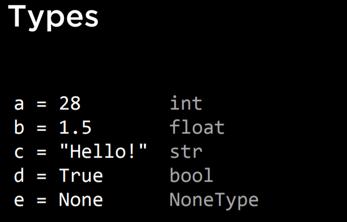
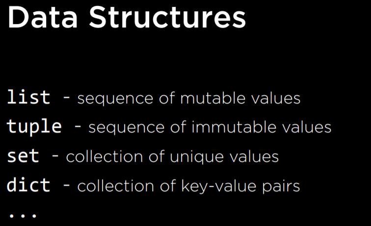
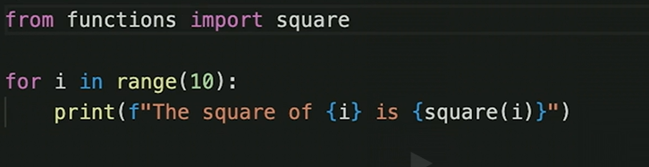
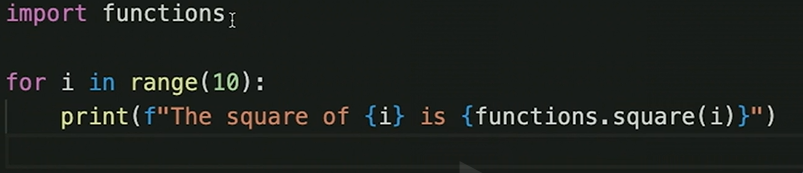

CS50

1. formatted strings

2. indentations are important in python.

    Eg : 

    if n>0 :
       print(.....)

  the body of the if conditional should be under and after "if" in the previous line.

3. "else if" is "elif" in python

4. Types in Python

5. Data Structures :

6. IMPORT 

* method 1 :

* method 2 :

