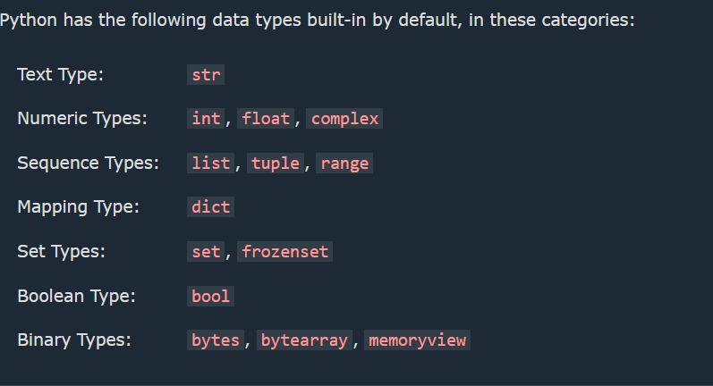

1. Cases :

 * Camel Case: 
   Each word, except the first, starts with a capital letter.

 * Pascal Case
   Each word starts with a capital letter.

 * Snake Case
  Each word is separated by an underscore character.

  2. Global Variables

 * Variables that are created outside of a function (as in all of the examples above) are known as global variables.

 * Global variables can be used by everyone, both inside of functions and outside.

 3. Built in Data Types :

 

 4. Python Numbers

 * Three types : 

      1. int 
      2. float 
      3. complex

5. Python Casting : 

  * Specify a Variable Type :

       1. There may be times when you want to specify a type on to a variable. This can be done with casting. Python is an object-orientated language, and as such it uses classes to define data types, including its primitive types.

       2. Casting in python is therefore done using constructor functions:

         * int() - constructs an integer number from an integer literal, a float literal (by removing all decimals), or a string literal (providing the string represents a whole number)

         * float() - constructs a float number from an integer literal, a float literal or a string literal (providing the string represents a float or an integer)

         * str() - constructs a string from a wide variety of data types, including strings, integer literals and float literals

