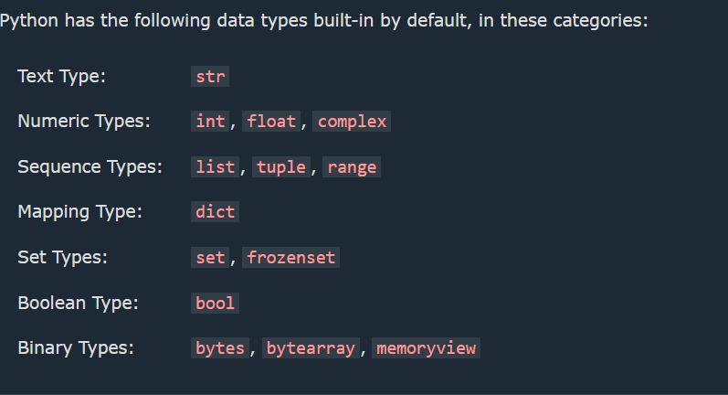

1. Cases :

 * Camel Case: 
   Each word, except the first, starts with a capital letter.

 * Pascal Case
   Each word starts with a capital letter.

 * Snake Case
  Each word is separated by an underscore character.

  2. Global Variables

 * Variables that are created outside of a function (as in all of the examples above) are known as global variables.

 * Global variables can be used by everyone, both inside of functions and outside.

 3. Built in Data Types :

 

 4. Python Numbers

 * Three types : 

      1. int 
      2. float 
      3. complex

